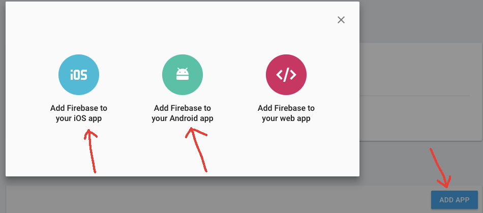
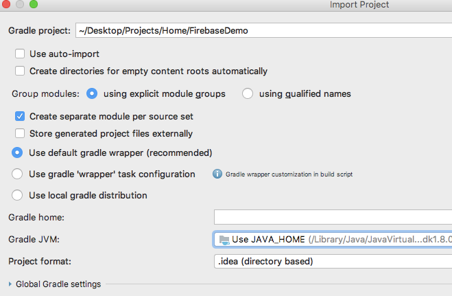

# Basic Firebase integration demo for iOS and Android


--
### Introduction
This is a basic example of hooking up to Firebase for registering and broadcasting push notifications to iOS and Android.

The demo is a simple JVM server written in Kotlin. The code has been kept very simple to focus on the Firebase integration.

There is an expected level of understanding of mobile apps to be able to digest this.

--
## Prerequisites

###Firebase Project

**Step 1 - create Firebase project**

If you haven't already created a new Firebase project you will need to create it. Log into Firebase and follow the documentation to create a new project. The following steps for iOS and Android will assume you have a basic project setup in Firebase.

**Step 2 - create a service account key**

After setting up the Firebase project, you will want to enable access via the **service account** associated with the project. Navigate to **Project Settings** (tap the small cog icon) then to the **Service Accounts** tab. It will look something similar to this:


Select the **GENERATE NEW PRIVATE KEY** button and download the resulting file - save the file as *service-account.json* into the root of this Git repository. **CRITICAL:** keep this file secure and don't lose it as you cannot obtain the same file again. It will be used to authenticate our web server to Firebase APIs to trigger push notification requests. In your own implementation you would keep this credential somewhere safe and secure within your infrastructure.


**Step 3 - enable Firebase API access**

By default, a Firebase project doesn't have API access enabled, so before we can call any authenticated APIs with our service account we need to enable it. Navigate to the API console via the **Manage all service accounts** link on the **SERVICE ACCOUNTS** tab.


You will be taken to the Firebase APIs console, look for a large **ENABLE** button and select it. There are other configuration options in this console that might be relevant for your use case but they are out of scope of this demo.

**Step 3 - create iOS and Android apps**

Navigate back to the **General** tab in Firebase and select the **ADD APP** button, then add both an iOS and Android app, filling in the required details.



After creating the Android app, you can download the generated *google-services.json* file and integrate it into your Android application code. Follow the Firebase documentation to learn how to do this.


You can also download the generated *GoogleService-Info.plist* file and integrated it into your iOS application code. Again, follow the documentation for integrating the Firebase SDK into iOS to find out how to do this.


**Step 4 - add iOS access key to enable APNS integration**

After creating the iOS Firebase app, you will need to configure it with an iOS **access key** to allow Firebase to connect to **APNS** on your behalf to deliver push notifications. Creating an iOS **access key** is explained in the next section, but once you have done this, you register it in Firebase by:

1. Navigating to the **CLOUD MESSAGING** tab in Firebase.
2. Uploading your **access key** file that would have been generated in the iOS developer portal (explained in next section)
3. Enter the **Key ID** that was generated in the iOS developer portal for the **access key**.
4. Enter the **App ID Prefix** associated with your iOS app (typically its the same as your *Team ID* but might not be).
5. Do **NOT** enter any push notification certificates - we are using the **access key** only.


At this stage, Firebase is more or less ready for us to use via our sample server.

###iOS

**Step 1 - iOS push notification access key**

Create (if you haven't already) an iOS **access key** to allow authentication to APNS and avoid needing to create the traditional certificates that used to be the most common way of configuration for iOS notifications. One of the advantages of using the **access key** instead of a **certificate** is that the key will not expire annually.

**CRITICAL** - store the newly created **access key** file somewhere secure and don't lose it - you cannot download it again. Also record the **Key ID** as you will need to enter it into your Firebase configuration along with the downloaded file.

There is a basic guide here: https://firebase.google.com/docs/cloud-messaging/ios/certs, and you can refer to the screenshots below as a guide for what to look for in the iOS developer portal.


**Step 2 - iOS application**

Create an iOS application ID and enable push notifications for it in the iOS developer portal but **do not add push notification certificates**. Instead, we will access APNS via the **access key** we created in step 1.

--
### Running the server

Clone or download the repository.

Before running the server, you will need to replace the existing *service-account.json* file in the root folder with your downloaded Firebase service account private key file (the file in the demo project is an empty stub so won't work).

You will also need to edit the source file *Firebase.kt* and put your own Firebase project id into the following constant:

```java
private const val firebaseProjectId = "<your_firebase_project_id>"
```

The demo server is Gradle based but you can use IntelliJ to open it for editing. If you wish to run the server via **Terminal** use the following Gradle command:

```
./gradlew appRun
```

> Note: the first time you run or open the project it may take a while to download all the required dependencies.

After successfully starting you should see:


--
To open the project in IntelliJ do the following:

1. Open IntelliJ and choose **Import Project**.
2. Navigate and open your cloned repository.
3. Pick settings similar to the following:




After opening the project in IntelliJ, install the **IntelliJ Jetty Runner** plugin, then create a new run profile similar to this:


You will then have a run profile that can be used to launch the server from within IntelliJ.

Also, if you wish, you can run the Gradle task **appRun** from the **Gretty** task group to launch the server:


> Opinion: The Jetty Runner plugin is much nicer to use while in IntelliJ!

--
### Demo APIs

There are only two APIs in the sample that simply illustrate registering and triggering notifications.

**Registering**

- POST
- http://localhost:8080/register
- Content-Type: application/json

```
iOS client would invoke this
{
	"platform": "ios",
	"userId": "AppleUser",
	"token": "Firebase-registration-id-provided-by-Firebase-SDK"
}
```
```
Android client would invoke this
{
	"platform": "android",
	"userId": "AndroidUser",
	"token": "Firebase-registration-id-provided-by-operating-system"
}
```

**Send notification**

- POST
- http://localhost:8080/send
- Content-Type: application/json

```
{
	"userId": "UserIdToTarget",
	"notificationTitle": "Title here!",
	"notificationBody": "Body here!"
}
```

--
### iOS notification integration

There are plenty of articles on the net about how to do this but you will need to install the Firebase SDK: https://firebase.google.com/docs/ios/setup.

Here is a super basic example of some of the common lifecycle callbacks in the main application delegate to deal with notifications (by no means exhaustive!):

```swift
import UIKit
import Firebase
import UserNotifications

@UIApplicationMain
class AppDelegate: UIResponder, UIApplicationDelegate, MessagingDelegate {
    var window: UIWindow?

    func application(_ application: UIApplication, didFinishLaunchingWithOptions launchOptions: [UIApplicationLaunchOptionsKey: Any]?) -> Bool {

        if #available(iOS 10.0, *) {
            let authOptions: UNAuthorizationOptions = [.alert, .badge, .sound]
            UNUserNotificationCenter.current().requestAuthorization(options: authOptions, completionHandler: { _, _ in })
        } else {
            let settings: UIUserNotificationSettings = UIUserNotificationSettings(types: [.alert, .badge, .sound], categories: nil)
            application.registerUserNotificationSettings(settings)
        }
        
        application.registerForRemoteNotifications()
        FirebaseApp.configure()
        Messaging.messaging().delegate = self

        return true
    }

    func application(_ application: UIApplication, didReceiveRemoteNotification userInfo: [AnyHashable: Any]) {
        print("NOTIFICATION RECEIVED! \(userInfo)")
    }
    
    func application(_ application: UIApplication, didReceiveRemoteNotification userInfo: [AnyHashable : Any], fetchCompletionHandler completionHandler: @escaping (UIBackgroundFetchResult) -> Void) {
        print("NOTIFICATION RECEIVED! \(userInfo)")
        completionHandler(.newData)
    }

    func messaging(_ messaging: Messaging, didReceiveRegistrationToken fcmToken: String) {
        print("FCM TOKEN: \(fcmToken)")
        // LOOK: The token can now be sent to the app server for registration
    }
    
    func messaging(_ messaging: Messaging, didReceive remoteMessage: MessagingRemoteMessage) {
        print("FCM PUSH NOTIFICATION RECEIVED: \(remoteMessage.appData)")
    }
    
    
    func application(_ application: UIApplication, didRegisterForRemoteNotificationsWithDeviceToken deviceToken: Data) {
        print("Device Token raw: \(deviceToken)")

        let tokenParts = deviceToken.map { data -> String in
            return String(format: "%02.2hhx", data)
        }

        let token = tokenParts.joined()
        print("Device Token parsed: \(token)")
    }

    func application(_ application: UIApplication, didFailToRegisterForRemoteNotificationsWithError error: Error) {
        print("Failed to register: \(error)")
    }
}

```

--
### Android notification integration

The documentation on Firebase runs through in fair detail how to configure an Android application: [https://firebase.google.com/docs/cloud-messaging/android/client](https://firebase.google.com/docs/cloud-messaging/android/client)
